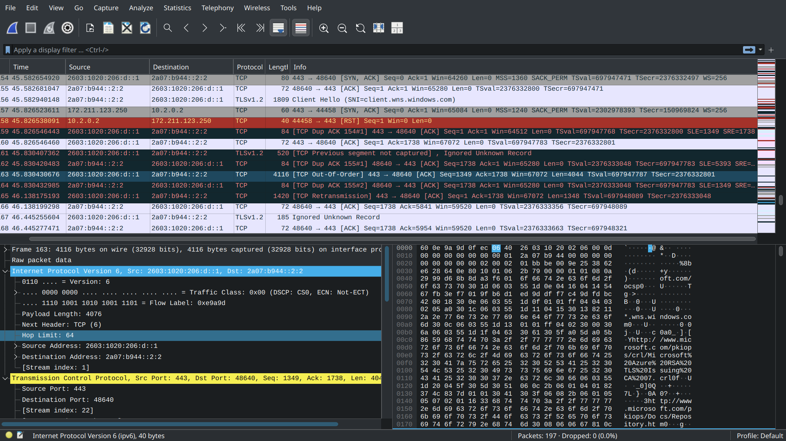
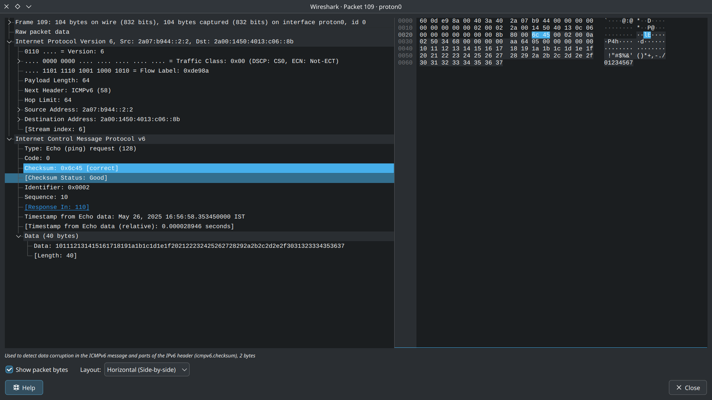

# ElateLabs-task1
NMap introduction and usage


This is a repository to depict the working and usage of Network Mapper immplemented on linux system

```
    >>> Script for Network Mapper
    >>> Depiction of wireshark packet analysis and tracking
    >>> Displaying each component of packet using wireshark
```


The below pictures depict how the wireshark performs the data transfer tracking analysis of packet when a ping to google.com is sent

```
Wireshark network analysis and packet tracking
```


```
Wireshark detailed analysis of single packet from transaction
```


```
    Steps of operation
```

1. installing nmap and wireshark

Since operating system is Archlinux with arch linux kernel install command is :
```
    $ sudo pacman -Sy nmap wireshark-gtk wireshark-cli
```

2. Obtained ip address and subnetmask

IP address was obtained from the command :
```
    $ ip -4 addr show scope global | grep inet | awk '{print $2}' | head -n 1
```

3. Using nmap 

Using the address nmap was used to find open networks or any vernabilities on network that are active or open using the command:
```
    sudo nmap -sS $(IPADDRESSwSUBNET)
```

The output is documented on Data/nmap.md

4. Using wireshark

Open wireshark using the command :

```
    $ wireshark &
```

After opening wireshark choose the network adapter filter that needs to obeserved on analysed and clicking on any any element will show the complete details of the packet choosen

Output of ping on google is also shared and documented on with screenshot and on files wireshark.txt & wireshark.csv